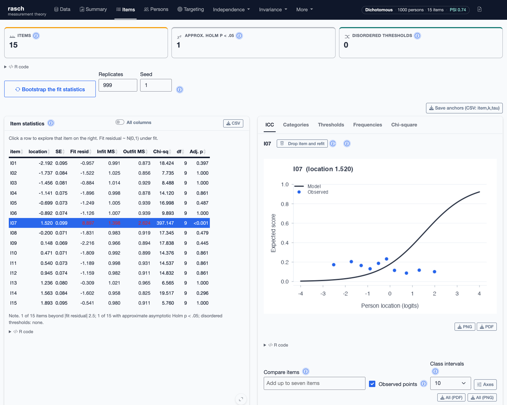

# rasch: Models and Diagnostics for Rasch Measurement Theory 

<!-- badges: start -->
[](https://CRAN.R-project.org/package=rasch)
[](https://github.com/drjoshmcgrane/rasch/actions/workflows/R-CMD-check.yaml)
[](https://drjoshmcgrane.github.io/rasch/)
<!-- badges: end -->

`rasch` fits and evaluates models within Rasch Measurement Theory. It includes
models for item responses, ratings, linked frames of reference, and paired
comparisons, with a common set of functions for examining fit, invariance,
targeting, dimensionality, and local dependence.

The models form a family united by the original dichotomous model
(Rasch, 1960),

$$
\log\frac{P(X_{ni}=1)}{P(X_{ni}=0)}=\theta_n-\delta_i.
$$

The sufficiency of the total score for $\theta_n$ allows item locations to
be estimated by pairwise conditioning (Zwinderman, 1995): given exactly one
of items $i$ and $j$ correct, the person parameter cancels,

$$
\log\frac{P(X_{ni}=1)}{P(X_{nj}=1)}=\delta_j-\delta_i,
$$

which is equivalent to the standard model for comparative judgement
(Andrich, 1978a; Bradley and Terry, 1952; Luce, 1959). The extensions keep
this structure: partial credit and rating scale models add ordered
thresholds (Andrich, 1978b; Masters, 1982); the many-facet model adds rater
and task locations to the composite (Linacre, 1989); the extended frame of
reference model links frames measured in different units (Humphry and
Andrich, 2008); polytomous comparative judgement applies the thresholds to
ordered pair judgements (Tutz, 1986).

The package treats fit to the model as an empirical question. Its diagnostics
examine whether comparisons remain invariant across persons, items, groups,
occasions, raters, and other parts of the measurement design.

## Models

| Function | Model |
|---|---|
| `rasch()` | Dichotomous Rasch, partial credit, and rating scale models |
| `rasch_mfrm()` | Many-facet Rasch model |
| `rasch_efrm()` | Extended frame of reference model |
| `btl()` | Comparative judgement models for dichotomous and polytomous paired comparisons |
| `btl_efrm()` | Extended frame of reference model for paired comparisons |

Person measures are estimated by weighted likelihood (Warm, 1989).
Anchored estimation is available for equating, and incomplete linked
designs can be fitted when their observed response structure identifies a
common scale.

The suite follows Rasch (1960) and Andrich and Marais (2019); the frame of
reference models follow Humphry's (2005) thesis, where the model is
introduced and named, and Humphry and Andrich (2008); the comparative
judgement models follow the BTL (Bradley and Terry, 1952; Luce, 1959) and
its adjacent-categories extension (Tutz, 1986).

## Shiny application

The package includes a graphical interface for analysts who do not normally
work in R. Launch it after installation with:

```r
rasch::run_app()
```

The application imports data, assigns variables to their measurement roles,
fits the selected model, and displays the resulting tables and plots. Results
can be downloaded, and the R call for each analysis is shown in the interface.

<p align="center">
  
</p>

## Installation

Install the CRAN release with:

```r
install.packages("rasch")
```

The development version is available from GitHub:

```r
# install.packages("remotes")
remotes::install_github("drjoshmcgrane/rasch")
```

## Example

```r
library(rasch)

d <- simulate_rasch(
  n_persons = 500,
  n_items = 10,
  n_groups = 2,
  seed = 1
)

fit <- rasch(d, model = "PCM", id = "id", factors = "group")

summary(fit)
fit_summary_table(fit)
targeting_table(fit)
dif_anova(fit)
residual_correlations(fit)
dimensionality_test(fit)

plot_pimap(fit)
plot_icc(fit, "I05", group = "group")
```

The [function reference](https://drjoshmcgrane.github.io/rasch/reference/index.html)
documents the data requirements and returned values for each analysis. The
[articles](https://drjoshmcgrane.github.io/rasch/articles/) give worked
examples for the main model families, DIF with repeated measures, and
simulation.

## References

Andrich, D. (1978a). Relationships between the Thurstone and Rasch
approaches to item scaling. *Applied Psychological Measurement*, 2(3),
451--462.

Andrich, D. (1978b). A rating formulation for ordered response categories.
*Psychometrika*, 43(4), 561--573.

Bradley, R. A., and Terry, M. E. (1952). Rank analysis of incomplete block
designs: I. The method of paired comparisons. *Biometrika*, 39(3/4),
324--345.

Andrich, D., and Marais, I. (2019). *A Course in Rasch Measurement Theory:
Measuring in the Educational, Social and Health Sciences*. Springer.

Humphry, S. M. (2005). *Maintaining a Common Arbitrary Unit in Social
Measurement*. PhD thesis, Murdoch University.

Linacre, J. M. (1989). *Many-Facet Rasch Measurement*. MESA Press.

Luce, R. D. (1959). *Individual Choice Behavior: A Theoretical Analysis*.
Wiley.

Masters, G. N. (1982). A partial credit model for scoring responses with
ordered categories. *Psychometrika*, 47(2), 149--174.

Humphry, S. M., and Andrich, D. (2008). Understanding the unit in the Rasch
model. *Journal of Applied Measurement*, 9(3), 249--264.

Rasch, G. (1960). *Probabilistic Models for Some Intelligence and Attainment
Tests*. Danish Institute for Educational Research. Expanded edition,
University of Chicago Press, 1980.

Tutz, G. (1986). Bradley-Terry-Luce models with an ordered response. *Journal
of Mathematical Psychology*, 30(3), 306--316.

Warm, T. A. (1989). Weighted likelihood estimation of ability in item
response theory. *Psychometrika*, 54(3), 427--450.

Zwinderman, A. H. (1995). Pairwise parameter estimation in Rasch models.
*Applied Psychological Measurement*, 19(4), 369--375.

## Citation

Use `citation("rasch")` to obtain the citation for the installed version.
